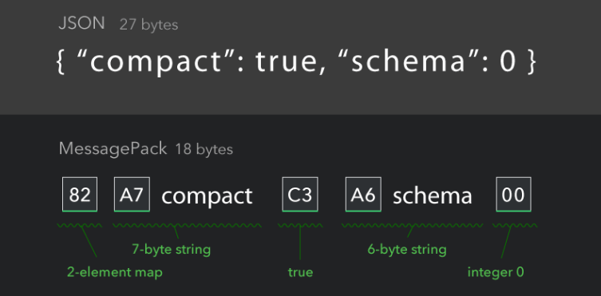

# The HeadPack Object Format

**TL;DR** It's a [JSON](https://www.json.org/json-en.html)-compatible binary
encoding format that is consistently smaller than
[MessagePack](https://msgpack.org/index.html) by placing structural information
in a header that precedes packed data.

```
       JSON: (44 bytes) {"easy":true,"as":{"pi":3.1415927410125732}}
MessagePack: (23 bytes) 82a4 easy c3a2 as 81a2 pi cb400921fb60000000
   HeadPack: (18 bytes) f9c089a44492 easyaspi 40490fdb
```

## Disclaimer
Hey, this is the developer, Martin Velikov here. Since I'm a recently graduated
year 12 high school student, take everything written here with a grain of salt.

HeadPack is just an alternative idea for an object encoding I had - don't take
it seriously. I, in no way, want to claim something like "I've made an encoding
format outright better than MessagePack and JSON! Everyone should use my
format!", primarily because that's stupid and naive.

Before everything, HeadPack is more like a study in object encoding formats, and
my only real starting goal was to see how much I can optimize the size of
encoded messages, with an "above-and-beyond" goal of beating MessagePack - which
I *think* I met, even if barely.

Even if HeadPack is not ready to be the magic replacement of JSON, I at least
hope you find this read interesting.

## What's wrong with JSON?
JSON is used basically everywhere nowadays - it is the de-facto data interchange
format for the web, the glue between a lot of remote-procedure-call APIs and
sometimes even the backbone for at-rest storage of complex objects, if not the
inspiration for more advanced formats.

One thing about JSON is that it's syntactically designed to be human readable.
This, among others, means two things:

1. JSON is "self-describing" (aka. "schemaless"). Any JSON reader can reconstruct
   the structure of the object, the types of sub-objects and their content by
   simply scanning through the JSON document. 
   - This is often not the case with binary encoding formats such as [Google's
   Protocol Buffers](https://protobuf.dev/) or [Cap'n
   Proto](https://capnproto.org/), which instead rely on a separate schema
   definition, though benefit massively both in size and parsing speed.

2. JSON is a sub-optimal representation for computer decoding. The cost of being
   human readable is that, often, even simple things like a boolean
   (theoretically encodable in 1 bit) has to take up a whole 4 bytes (`'t'`
   `'r'` `'u'` `'e'`) in order to be understandable by humans. Something like a
   floating-point number or an integer has to be encoded as its string
   representation, and collections with size `N` elements (or key-value pairs)
   have to waste *at least* `N-1` bytes to delimit entries with commas. This is
   tremendously wasteful of space, which is often scarce in embedded
   environments.
 
     - Despite this, JSON [compresses
       well](https://lemire.me/blog/2021/06/30/compressing-json-gzip-vs-zstd/),
       which means that a lot of this slack is picked up by conventional
       compression formats, while still retaining human readability. 
       - In comparison, binary formats, (including the aforementioned Protobuf,
       Cap'n Proto, MessagePack and HeadPack) may actually compress **worse**,
       which means that they are only really useful when large text compression
       algorithms like GZip, Brotli and Zstd cannot be afforded, which is a
       surprisingly large amount of the time.
     - Sometimes, crazy (aka. dedicated & smart) people build 6GB/s JSON
       parsers. Case in point, [simdjson](https://github.com/simdjson/simdjson)
       exists.

Most of the time, I believe the tradeoffs above are worth it in the long run.
Most of the shortcomings of JSON are often negligible compared to its benefits,
which is demonstrated by its ongoing and ubiquietous usage.

Despite this, I believe it *is* possible to design a more space-efficient and
computer friendly format that is still self-describing and flexible to work
with. In fact, I'm not the first one to think this, and I'm definitely not the
first to make one!

## What's wrong with MessagePack?
MessagePack optimizes the representation of JSON objects further by doing away
with human readibility, and instead encodes structural information immediately
before the appearance of the data the structure references. One of the best
demonstrations of this is [the demo on the front page of the MessagePack
site](https://msgpack.org/index.html).



*Notice how, for every unit of data, be it a map, string, boolean, there is a
one-byte overhead which encodes useful things like the unit's type and length.*

For reference, yes, HeadPack encodes this JSON in less space than MessagePack,
albeit in just one byte less. :P

```
       JSON: (27 bytes) {"compact":true,"schema":0}
MessagePack: (18 bytes) 82a7636f6d70616374c3a6736368656d6100
   HeadPack: (17 bytes) fce9ac00636f6d70616374736368656d61
```

MessagePack's simplicity and relatively great compactness makes it quite
appealing to use - it's simple to implement and fast to use in practice.

But... it's not the smallest thing possible. The fact that there is a guaranteed
one-byte overhead for every unit of data adds up slowly, and may result in
suboptimal encoding for both small and large objects. In practice, the
difference between MessagePack and HeadPack can be as high as something like
20%.

HeadPack was born out of the curious desire if I could outperform MessagePack in
encoding size. A friend even asked me at one point: "Is it even possible to go
smaller?", and I can confidently answer that question with a yes now. :)

## What about Protobuf and Cap'n Proto?
These binary formats are sort of in a league of their own. Even if they achieve
sizes smaller than what both HeadPack and MessagePack achieve, they are, as
mentioned earlier, not schemaless, which categorically separates them from
encodings like MessagePack & HeadPack.

## What does HeadPack do differently?
- Structural data is stored differently. In JSON, MessagePack, ProtoBuf and
  Cap'n Proto, type and length data is stored adjacently to the data itself,
  which makes it easier for parsers to manage, but can be wasteful of payload
  size, and would make this information difficult to separate from the actual
  data. In HeadPack, as the name implies, all of this information is stored in a
  header that precedes the data and can be read (or potentially shared?) ahead of time.

  - While I initially wanted to make the entire HeadPack header fully separable
    from the data (making it akin to a "schema"), in pursuit of size
    optimizations, I decided to leave this feature out and cram as much
    information as possible into the header, such as length of the data encoded.
    As a potential future improvement over HeadPack, maybe a few sacrifices to
    space efficiency could be made to acommodate this feature, though if this
    were to happen I doubt any benefits over MessagePack would be left.

  - Potentially, because all textual data is mostly adjacent in the data
    section, maybe some compressions would perform better under certain
    conditions while using HeadPack, as the message without its header resembles
    something like regular plaintext.

- No sizing limits - theoretically, HeadPack does not have the sizing limits
  that MessagePack has for sized types like arrays, & strings, though, in
  practice, you probably don't want an array with 2^273 elements unless you're
  trying to collect JSON information about every atom in the universe. Also,
  parsers don't have infinite memory. Yet. 
  
  - Integers, however, have a definite limit to size - 128 bits for both signed
    and unsigned integers.

- Custom fixed-length types. Like MessagePack, HeadPack leaves a function for
  users to define their own custom fixed-length types, which can be efficiently
  encoded and decoded adjacently with the regular built-in types.

- HeadPack supports a variable-length "raw bytes" type, something I often wish
  JSON had in some shape or form besides base64. 

- HeadPack always encodes a floating point number in the least number of bytes
  it can use without losing any precision. For integers, you can be certain that
  the least number of bytes are used to represent that integer, yes, **even for
  signed integers**.

- HeadPack supports `null` as a type, without it being a mistake or it costing a
  billion dollars or something.

## So... in summary?
HeadPack isn't the fastest encoding, it's not the simplest encoding, it's not
the replacement for existing encoding schemes, but it *is* the smallest encoding
(compared to its arch nemesis, MessagePack) and it nonetheless presents some
interesting ideas which could be worth taking further. Also, it was fun to think
about and write.

# Specification
Now that we're done with the philosophical part of HeadPack, and you're burning
to know some more techincal aspects, it's time to delve into how it actually
works.
## Terminology
Let's introduce some basic terminology for the different moving parts of
HeadPack.

### Message
A JSON document encoded using HeadPack is called a *Message*. A *Message*
contains a single root *Object*, which is, by necessity, either a *Map*,
equivalent to JSON's `{}`, or a `List`, equivalent to JSON's `[]`.

### Object
Everything that carries data or gives structure to a HeadPack message is an
*Object*. If you convert the below JSON message to HeadPack, you would have `10`
total objects. Notice how both collections like `Map` & `List` and data types
like `String`, `SInt`, `Bool` and `Float` count as objects.

```jsonc
// this is the root element, doesn't count
{
    // String (1)  String (2)
    "hello":       "world",
    // String (3)
    "stuff": [  // List (4)
        1,      // SInt (5)
        2,      // SInt (6)
        3,      // SInt (7)
        true,   // Bool (8)
        3.14159 // Float (9)
    ]
}
```

Objects are flattened in a Message in the order they appear. For example,
the above message would be serialized as
```
type: Map  String   String   String   List  SInt SInt SInt  Bool  Float
data:      "hello"  "world"  "stuff"        1    2    3     true  3.14159
``` 

### Classes
In HeadPack, there are `12` total Object "types" which can compose a structure.
These are intended to be a superset of the types commonly seen in JSON, such as `String`, `Bool`, etc.

However, reserving `4` bits just to store a type id would be inefficient, and so
HeadPack has a more efficient system for type information storage.

In HeadPack, all types fall under four categories calls type *Classes*. Because
there are only four of them, they can be identified using just two bits each.

#### List of Type Classes

- `ID 0` **String**
  - Human-readable variable-length text encoded in UTF-8.
- `ID 1` **Bytes**
  - Variable length contiguous array of raw bytes.
- `ID 2` **Collection**
    - List
      - Array of objects. Equivalent to JSON's `[ a, b, c, ... ]`.
    - Map
      - Key-value dictionary. Equivalent to JSON's `{ a: b }`.
      - Yes, map keys can be *any* Object, even maps.
- `ID 3` **Numeric**
    - `SInt` - Signed Integer
      - Always occupies the least number of space required to store.
      - Between `8` and `128` bits in size.
    - `UInt` - Unsigned Integer 
      - Always occupies the least number of space required to store.
      - Between `8` and `128` bits in size.
    - `Float32` - Single-precision decimal
      - Equivalent to C's `float` or Rust's `f32`
    - `Float64` - Double-precision decimal
      - Equivalent to C's `double` or Rust's `f64`
    - `Null`
      - Note that this is its own type. Objects are not arbitrarily nullable.
    - `Timestamp32`
      - Second-level precision Unix timestamp
      - Equivalent to a fixed `32-bit` unsigned integer
    - `UserDefined`
      - Fixed length that **MUST** be specified by user.
      - Contains an `ID` in the range `39` to `63`.

### Lengths
In order to read the data properly, the decoder needs to know how long the data
stored in an Object is. You can imagine this is especially important with
`String`'s and `Bytes`.

Furthermore, as you can see, save for `String` and `Bytes`, it's not enough to
just know an Object's Class to be able to figure out its type. 
- An object of class Numeric can be 7+ different types!
- Is this Collection a `List` or a `Map`?

In the case of collections and Numeric classes, types are determined by
encoding information in the length value of the object.

#### Collections
For collections, if the lowest bit of length is `1`, then the type is `List`,
otherwise it's `0`. The actual length (in elements) of the collection is the
rest of the bits taken from the second lowest.
- Example 1, given the length `00000100`:
  - Check the last bit, `0000010 -> 0 <-`
    - It's a `0`, so this must be a `Map`!
  - The length of our map is `0000010` = `2` key-value pairs
  - Result: This is a `Map` with length `2`
- Example 2, given the length `00011101`:
  - Check the last bit, `0001110 -> 1 <-`
    - It's a `1`, so this must be a `List`!
  - The length of our list is `0001110` = `14` list elements
  - Result: This is a `List` with length `14`

#### Numeric
Let `L` be the length of an object `O` of class Numeric.

- if `1 ≤ L ≤ 16`, then `O` is an `SInt` with length `L`
- if `17 ≤ L ≤ 32`, then `O` is a `UInt` with length `L - 16`
- if `L = 33`, then `O` is a `Float32` with length `4`
- if `L = 34`, then `O` is a `Float64` with length `8`
- if `L = 35`, then `O` is a `Null` with length `0`
- if `L = 36`, then `O` is a `Bool` set to `false` with length `0`
- if `L = 37`, then `O` is a `Bool` set to `true` with length `0`
- if `L = 38`, then `O` is a `Timestamp32` with length `4`
- if `39 ≤ L ≤ 63`, then `O` is a `UserDefined` with ID `L` and user-specified length

**Congratulations!** Now that we know how to parse and Object from its 2-bit class and
its length, we are now ready to delve into how HeadPack formats Messages.

## Message Format
HeadPack relies on three sections: the *`CLASS`* section, the *`LENGTH`* section and the *`DATA`* section.

#### Legend
### `CLASS` Section
This is the first section in a Message, and it contains type information
regarding the class of each object. It's effectively an array of Classes
represented by their 2-bit ID. Because each ID is two bits, we can fit up to
three class definitions into a single byte, and reserve the last two bits as the
count (0 to 3) of classes in the next byte.

For example, suppose we had 5 objects (A, B, C, D, E) for which we needed to
store the classes. We could put the classes of A, B, C in the first 6 bits of a
byte, followed by the number 2 (`10` in binary) to signal that the next byte
contains only D & E's classes, and extrapolate this pattern, for larger numbers
of classes.

The first two bits of the first byte must then be reserved to signal how many
classes are stored in the first byte. The last two bits of the first byte must also be reserved to signal how many classes are stored in the second byte, and then the normal pattern described above continues.

```
Legend: 
  . means that bit is irrelevant
  bits 0 to 7 are shown as 01 23 45 67

====== Example 1 ======

first byte (chunk):
      10 AA BB 10 <-- finally, a 2 again because the next chunk contains 2 more classes
      ^  ^^ ^^ 
      |   \__|____________________________________________________________
      |                                                                   \
      two bits storing "2" because both A & B's class id's are stored in here

second byte:
      DD EE .. ..  <-- the 2 at the end of the last chunk said that 
                       only D & E's 2-bit ids are contained here

====== Example 2 ======

first byte:
      10 AA BB 11  <-- 11 in binary = 3
      ^^
      2 again, so A & B are in the first byte like before

second byte:
      CC DD EE 11  <-- another 3 at the end, so F, G & H must be in the next chunk
      ^^ ^^ ^^
      because of the 3 at the end of the first chunk, we see C, D & E here

      FF GG HH 01  <-- 01 in binary = 1, so the next chunk is the last one
      II .. .. ..      and it only contains 1 more class id

====== Example 3 ======

first byte:
      11 AA BB CC
      ^^
      a 3 here means that there are only 3 total 
      objects to store, so this is the only chunk!

====== Example 4 ======

first byte:
      01 AA .. ..
      ^^
      a 1 here means that there is only 1 total 
      object to store
```
And that's pretty much it about the class section! If you decoded it properly,
you should have an array of object classes which:

1. Tells you how many objects there are in total.
2. Tells you a little bit about the structural hierarchy of the message, though
   you don't know if collections are maps or lists yet.

### `LENGTH` section

### `DATA` section

